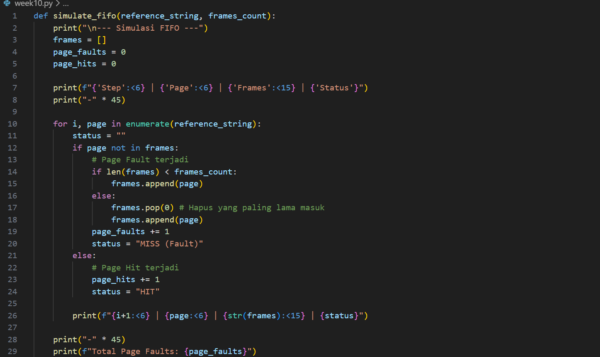
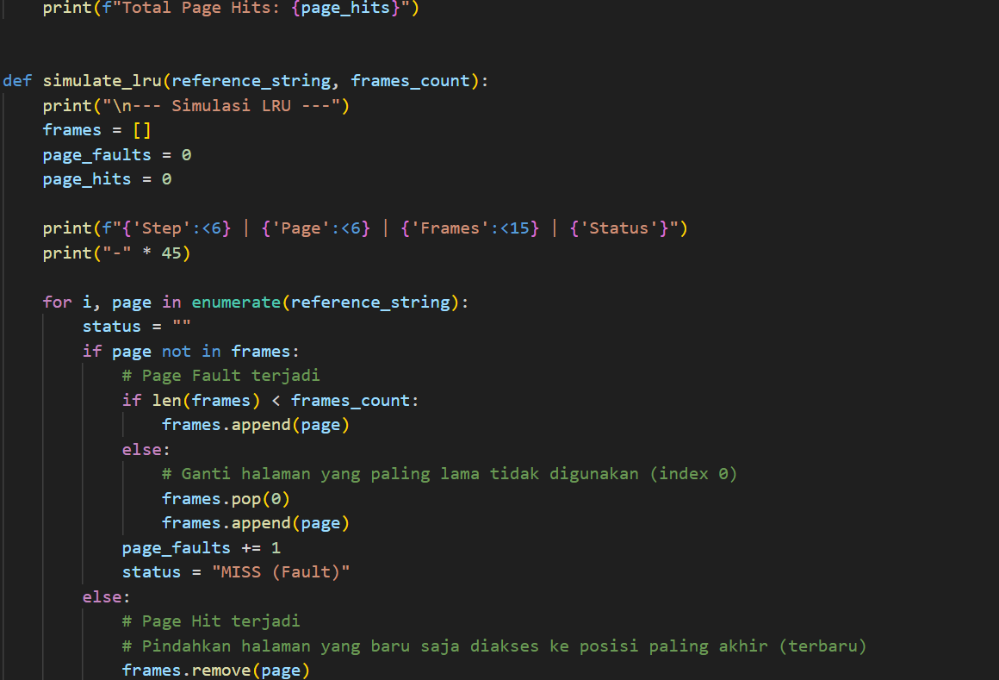
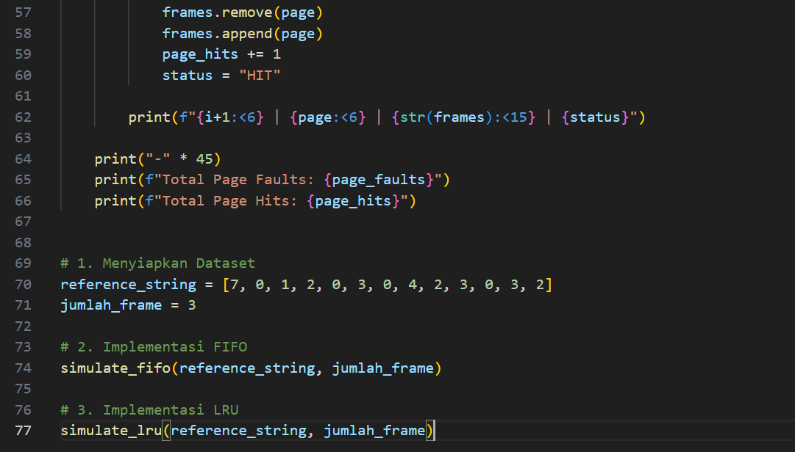
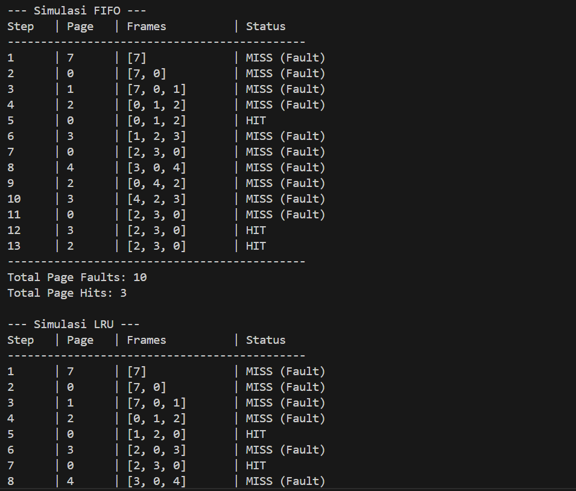
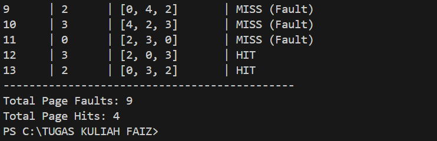

# Laporan Praktikum Minggu [X]
Topik: Manajemen Memori – Page Replacement (FIFO & LRU)

---

## Identitas
- **Nama**  : Faizal Muzaki  
- **NIM**   : 250202937 
- **Kelas** : 1IKRB

---

## Tujuan
  
> 1. Mengimplementasikan algoritma page replacement FIFO dalam program.
> 2. Mengimplementasikan algoritma page replacement LRU dalam program.
> 3. Menjalankan simulasi page replacement dengan dataset tertentu.
> 4. Membandingkan performa FIFO dan LRU berdasarkan jumlah *page fault*.
> 5. Menyajikan hasil simulasi dalam laporan yang sistematis.

---

## Dasar Teori
Dalam sistem operasi, Manajemen Memori menggunakan teknik Virtual Memory untuk memungkinkan eksekusi proses yang ukurannya melampaui kapasitas fisik RAM. Ketika RAM penuh dan sistem membutuhkan halaman (page) baru, sistem harus memilih halaman mana yang akan dikeluarkan (di-swap) ke disk. Inilah peran dari Algoritma Page Replacement.

1. FIFO (First-in, first-out)
   Algoritma ini adalah yang paling sederhana untuk dipahami dan diimplementasikan. prinsip kerja,halaman yang paling duku masuk ke memori adalah halaman yang akan paling dulu diganti.
2. LRU (Least Recentl Used)
   LRU di anggap sebagai alooritma yang lebih cerdas di banding FIFP karena melihat riwayat pengguna halaman.

---

## Langkah Praktikum
1. Membuat folder ```praktikum/week10-page-replacement/``` dengan subfolder code dan screenshots.
2. Membuat file ```reference_string.txt``` berisi data uji: ```7, 0, 1, 2, 0, 3, 0, 4, 2, 3, 0, 3, 2``` dan menetapkan jumlah frame = 3.
3. Membuat program Python (```page_replacement.py```) yang membaca file dataset, mensimulasikan antrian frame untuk FIFO, dan stack penggunaan untuk LRU.
4. Menjalankan program di terminal dan mencatat setiap kali status MISS (Page Fault) terjadi.
5. Mendokumentasikan seluruh hasil simulasi, perhitungan, dan analisis dalam file laporan.md.
6. Commit & Push
```

git add .
git commit -m "Minggu 10 - Page Replacement FIFO & LRU"
git push origin main

```

---

## Kode / Perintah
Berikut adalah potongan logika utama untuk kedua algoritma:





```
python code/page_replacement.py
```


## Hasil Eksekusi
Berikut adalah output program saat dijalankan dengan dataset uji:



---

## Analisis
1. Tabel perbandingan algoritma
   
| Algoritma | Jumlah Page Fault | Keterangan |
   |:--|:--:|:--|
   | FIFO | 10 | halaman di ganti murni berdasarkan urutan masuk tanpa melihat aktivitas pengguna |
   | LRU | 9 | halaman di ganti berdasarkan riwayat akses; halaman yang baru saja digunakan cenderung dipertahankan |


2. Analisis perbedaan page fault
   perbedaan ini terjadi karena perbedaan kecerdasa dalam memilih halaman yang harus dikeluarkan (victim page):
   1. Akurasi prediksi: FIFO berasumsi bahwa halaman tertua tidak lagi diperlukan. namun, dalam kenyataannya halaman tertua bisa saja merupakan halaman yang paling sering diakses. saat FIFO membuang halaman aktif ini, sistem akan segera mengalami page fault lagi.
   2. Pemanfaatan Temporal Locality: LRU berkerja dengan prinsip bahwa jika suatu halaman baru saja diakses, ia kemungkinan besar alan diakses lagi dalam waktu dekat. LRU melacak usia pengguna bukan usia masuk.

3. Analisis mana yang lebih efisien.
   Dalam hampir semua skenario nyata, LRU lebih efisien dari pada FIFO. Alasannya:
   - Minimisasi page fault: secara statistik, LRU menghasilkan jumlah page fault yang lebih rendah karena ia beradaptasi dengan pola prilaku program (lokalitas referensi).
   - Stabilitas: FIFO memiliki kelemahan unik yang disebut Anomali Belady, dimana penambahan jumlah frame fisik justru bisa menyebabkan page fault meningkat. LRU termasuk golongan Stack Algorithm yang secara matematis terbukti terbukti tidak akan mengalami anomali ini. Semakin banyak RAM yang diberikan, performa LRU dipastikan akan semakin membaik.
---

## Kesimpulan
1. Efisiensi Berdasarkan Pola Akses: Algoritma LRU lebih efisien dibandingkan FIFO karena menghasilkan jumlah page fault yang lebih sedikit (9 vs 10 pada studi kasus). Hal ini dikarenakan LRU mempertimbangkan aspek temporal locality, yaitu mempertahankan halaman yang baru saja digunakan karena kemungkinan besar akan diakses kembali dalam waktu dekat.
2. Kelemahan Logika FIFO: Algoritma FIFO memiliki kelemahan dalam menentukan "halaman korban" karena hanya melihat urutan waktu masuk tanpa mempedulikan seberapa sering halaman tersebut diakses. Hal ini berisiko menimbulkan Anomali Belady, di mana peningkatan jumlah frame memori justru dapat meningkatkan jumlah page fault, sesuatu yang tidak akan terjadi pada algoritma LRU.
3. Trade-off Implementasi: Meskipun LRU lebih optimal dalam menekan page fault, implementasinya jauh lebih kompleks dan membutuhkan dukungan perangkat keras (hardware overhead) untuk mencatat riwayat akses. Sebaliknya, FIFO sangat mudah diimplementasikan dengan struktur data queue sederhana namun dengan konsekuensi performa yang lebih rendah.

---

## Quiz
1. Apa perbedaan utama FIFO dan LRU?
    
   **Jawaban:** FIFO berfokus pada waktu kedatangan, sedangkan LRU berfokus pada waktu pengguna.   
2. Mengapa FIFO dapat menghasilkan *Belady’s Anomaly*? 
   **Jawaban:** karena FIFO tidak memiliki kolerasi langsung antara durasi halaman di memori dengan probabilitas penggunanya kembali.
3. Mengapa LRU umumnya menghasilkan performa lebih baik dibanding FIFO?
  
   **Jawaban:** LRU pada umumnya memberikan performa lebih baik dari pada FIFO karena ia berkerja berdasarkan prinsip psiklogi, bukan sekedar urutan administratif.

   jika diibaratkan dengan meja kerja:
   - FIFO akan membuang buku yang paling pertama diletakan di meja, meskipun saat ini kita sedang membaca buku.
   - LRU akan membuang buku yang sudah tertumpuk paling bawah dan sudah berdebu karena tidak pernah kita buka lagi. 

---

## Refleksi Diri

- hal yang paling menantang memikirkan kode pythonnya.  
- belajar lebih giat.  

---

**Credit:**  
_Template laporan praktikum Sistem Operasi (SO-202501) – Universitas Putra Bangsa_
