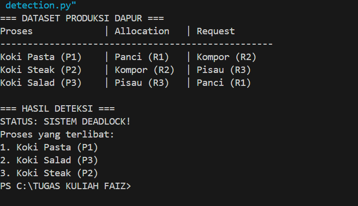
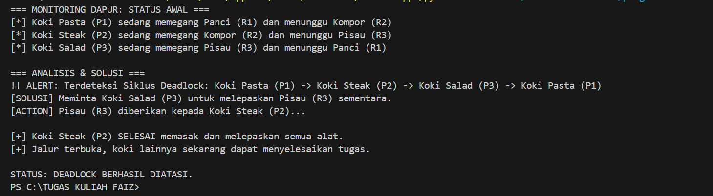

# Laporan Praktikum Minggu 11
Topik: Simulasi dan Deteksi Deadlock


---

## Identitas
- **Nama**  : Faizal Muzaki 
- **NIM**   : 250202937 
- **Kelas** : 1IKRB

---

## Tujuan
Setelah menyelesaikan tugas ini, mahasiswa mampu:
1. Membuat program sederhana untuk mendeteksi deadlock.  
2. Menjalankan simulasi deteksi deadlock dengan dataset uji.  
3. Menyajikan hasil analisis deadlock dalam bentuk tabel.  
4. Memberikan interpretasi hasil uji secara logis dan sistematis.  
5. Menyusun laporan praktikum sesuai format yang ditentukan.

---

## Dasar Teori
- Definisi deadlock: sebuah kondisi dimana sekumpulan proses berhenti secara permanen karena setiap proses menunggu sumber data yang sedang digunakan oleh proses lain dalam setiap kelompok.

- Empat syarat mutlak: deadlock hanya akan terjadi jika empat kondisi ini terpenuhi secara bersamaan, yaitu; MUtual Exclusion, Hold and Wait, No Preemption, dan Circular Wait.

- Strategi Deteksi: strategi ini membiarkan deadlock terjadi, namun sistem secara berkala nebjalankan algoritma untuk memeriksanya; sistem instansi tunggal, dan sistem instansi banyak.

---

## Langkah Praktikum
1. 1. **Menyiapkan Dataset**

   Gunakan dataset sederhana yang berisi:
   - Daftar proses  
   - Resource Allocation  
   - Resource Request / Need

   Data Tabel:

   | Proses | Allocation | Request |
   |:--:|:--:|:--:|
   | Koki Pasta | Panci | Kompor |
   | Koki Steak | Kompor | pisau |
   | Koki Salad | Pisau | Panci |

2. **Implementasi Algoritma Deteksi Deadlock**

   Program minimal harus:
   - Membaca data proses dan resource.  
   - Menentukan apakah sistem berada dalam kondisi deadlock.  
   - Menampilkan proses mana saja yang terlibat deadlock.

3. **Eksekusi & Validasi**

   - Jalankan program dengan dataset uji.  
   - Validasi hasil deteksi dengan analisis manual/logis.  
   - Simpan hasil eksekusi dalam bentuk screenshot.

4. **Analisis Hasil**

   - Sajikan hasil deteksi dalam tabel (proses deadlock / tidak).  
   - Jelaskan mengapa deadlock terjadi atau tidak terjadi.  
   - Kaitkan hasil dengan teori deadlock (empat kondisi).

5. **Commit & Push**

   ```bash
   git add .
   git commit -m "Minggu 11 - Deadlock Detection"
   git push origin main
   ```


---
## Kode / Perintah
Tuliskan potongan kode atau perintah utama:

1. program deadlock_detection.Py


```bash
def deadlock_detection():
    # 1. MENYIAPKAN DATASET (Membaca data proses dan resource)
    # P1-P3: Koki, R1-R3: Alat Masak
    dataset = [
        {"proses": "Koki Pasta (P1)", "allocation": "Panci (R1)", "request": "Kompor (R2)"},
        {"proses": "Koki Steak (P2)", "allocation": "Kompor (R2)", "request": "Pisau (R3)"},
        {"proses": "Koki Salad (P3)", "allocation": "Pisau (R3)", "request": "Panci (R1)"}
    ]

    print("=== DATASET PRODUKSI DAPUR ===")
    print(f"{'Proses':<18} | {'Allocation':<12} | {'Request':<12}")
    print("-" * 50)
    for d in dataset:
        print(f"{d['proses']:<18} | {d['allocation']:<12} | {d['request']:<12}")

    # 2. MENENTUKAN KONDISI DEADLOCK
    # Mapping: Siapa yang memegang resource apa
    resource_owner = {d['allocation']: d['proses'] for d in dataset}
    
    # Membangun Wait-For Graph (Siapa menunggu Siapa)
    wait_for_graph = {}
    for d in dataset:
        pengirim = d['proses']
        target_res = d['request']
        if target_res in resource_owner:
            wait_for_graph[pengirim] = resource_owner[target_res]

    # Fungsi untuk mendeteksi siklus melingkar
    def find_cycle(start_node):
        visited = []
        current = start_node
        while current in wait_for_graph and current not in visited:
            visited.append(current)
            current = wait_for_graph[current]
            if current == start_node:
                return visited
        return None

    # Mencari proses yang terjebak dalam siklus
    deadlocked_processes = set()
    for d in dataset:
        cycle = find_cycle(d['proses'])
        if cycle:
            for p in cycle:
                deadlocked_processes.add(p)

    # 3. MENAMPILKAN HASIL
    print("\n=== HASIL DETEKSI ===")
    if deadlocked_processes:
        print("STATUS: SISTEM DEADLOCK!")
        print("Proses yang terlibat:")
        for i, p in enumerate(sorted(deadlocked_processes), 1):
            print(f"{i}. {p}")
    else:
        print("STATUS: SISTEM AMAN")

if __name__ == "__main__":
    deadlock_detection()

```

2. program deadlock_solution.Py

```bash
import time

def deadlock_solution():
    # 1. DATASET: Kondisi Awal Terdeteksi Deadlock
    # Struktur: {Proses: [Resource_Held, Resource_Needed]}
    dapur = {
        "Koki Pasta (P1)": {"hold": "Panci (R1)", "need": "Kompor (R2)"},
        "Koki Steak (P2)": {"hold": "Kompor (R2)", "need": "Pisau (R3)"},
        "Koki Salad (P3)": {"hold": "Pisau (R3)", "need": "Panci (R1)"}
    }

    print("=== MONITORING DAPUR: STATUS AWAL ===")
    for koki, alat in dapur.items():
        print(f"[*] {koki} sedang memegang {alat['hold']} dan menunggu {alat['need']}")
    
    # 2. DETEKSI SIKLUS
    # Membangun wait-for graph: Siapa menunggu Siapa
    # P1 -> P2 (karena P2 pegang Kompor), dst.
    holder_map = {v['hold']: k for k, v in dapur.items()}
    wait_for_graph = {k: holder_map[v['need']] for k, v in dapur.items()}
    
    def find_cycle(start_node):
        visited = []
        curr = start_node
        while curr in wait_for_graph and curr not in visited:
            visited.append(curr)
            curr = wait_for_graph[curr]
            if curr == start_node: return visited
        return None

    cycle = find_cycle("Koki Pasta (P1)")

    # 3. IMPLEMENTASI SOLUSI (RESOURCE PREEMPTION)
    print("\n=== ANALISIS & SOLUSI ===")
    if cycle:
        print(f"!! ALERT: Terdeteksi Siklus Deadlock: {' -> '.join(cycle)} -> {cycle[0]}")
        
        # Langkah Solusi: Pilih satu koki untuk dipaksa mengalah (Preemption)
        korban = cycle[-1]
        alat_lepas = dapur[korban]['hold']
        target_koki = [k for k, v in dapur.items() if v['need'] == alat_lepas][0]
        
        print(f"[SOLUSI] Meminta {korban} untuk melepaskan {alat_lepas} sementara.")
        print(f"[ACTION] {alat_lepas} diberikan kepada {target_koki}...")
        
        # Simulasi Pemulihan Jalur
        time.sleep(1)
        print(f"\n[+] {target_koki} SELESAI memasak dan melepaskan semua alat.")
        print(f"[+] Jalur terbuka, koki lainnya sekarang dapat menyelesaikan tugas.")
        print("\nSTATUS: DEADLOCK BERHASIL DIATASI.")
    else:
        print("Sistem berjalan normal.")

if __name__ == "__main__":
    deadlock_solution()

```

3. Perintah Eksekusi
  ```
  python code/deadlock_detection.py
  ```

  ```
  python code/deadlock_solution.py
  ``` 

---


## Hasil Eksekusi
- Hasil mendeteksi deadlock



- Hasil solusi deadlock


---

## Analisis

1. Deskripsi Skenario (Dataset)
   Dalam skenario dapur restoran ini, terdapat tiga koki yang bertindak sebagai Proses (P) dan tiga alat masak yang bertindak sebagai Sumber Daya (R). Koki Pasta (P1) menguasai Panci (R1) tetapi memerlukan Kompor (R2) untuk lanjut. Di saat yang sama, Koki Steak (P2) telah menduduki Kompor (R2) namun terhenti karena membutuhkan Pisau (R3). Terakhir, Koki Salad (P3) sudah memegang Pisau (R3) namun tidak bisa bekerja karena menunggu Panci (R1) yang masih dibawa oleh Koki Pasta.

2. Analisis Deteksi Deadlock
   Berdasarkan algoritma pendeteksian yang kita buat, sistem teridentifikasi mengalami Deadlock. Hal ini terjadi karena terbentuknya Wait-for Graph yang melingkar. Secara teknis, program menemukan bahwa P1 menunggu P2, P2 menunggu P3, dan P3 kembali menunggu P1. Karena tidak ada satu pun koki yang bisa mendapatkan alat tambahannya, semua koki berhenti bekerja secara permanen dalam kondisi "Menunggu".

3. Berdasarkan teori Coffman, kejadian di dapur ini secara sempurna memenuhi empat syarat terjadinya deadlock:
   
   - Mutual Exclusion: Alat masak bersifat eksklusif; satu panci tidak bisa digunakan dua koki sekaligus untuk masakan berbeda.
   - Hold and Wait: Setiap koki bersikeras memegang alat yang sudah mereka ambil (Hold) sambil tetap mengantre untuk alat berikutnya (Wait). Tidak ada koki yang mau menaruh alatnya kembali ke rak sebelum masakannya matang.
   - No Preemption: Dalam sistem ini, alat masak tidak boleh direbut paksa dari tangan koki. Alat hanya bisa bebas jika koki tersebut menyelesaikannya secara sukarela.
   - Circular Wait: Terjadi rantai ketergantungan melingkar di mana ujung rantai kembali ke titik awal, mengunci seluruh koki dalam satu lingkaran kebuntuan.

---

## Kesimpulan
1. Deteksi Berbasis Siklus (Circular Wait): Kesimpulan utama adalah bahwa deadlock pada sistem dengan single-instance resource (seperti alat masak tunggal) hanya terjadi jika terbentuk siklus ketergantungan antar proses. Dalam praktikum ini, program berhasil mengidentifikasi bahwa P1, P2, dan P3 terjebak dalam deadlock karena adanya rantai menunggu melingkar yang memenuhi empat syarat Coffman secara bersamaan.
2. Pentingnya Strategi Pemulihan (Recovery): Praktikum menunjukkan bahwa sistem yang mengalami deadlock tidak dapat pulih dengan sendirinya tanpa intervensi eksternal. Metode Resource Preemption (pengambilalihan paksa) terbukti efektif sebagai solusi jangka pendek untuk memutus siklus tersebut, meskipun harus mengorbankan salah satu proses (koki) agar proses lainnya dapat berjalan hingga selesai.
3. Manajemen Alokasi vs. Jumlah Sumber Daya: Hasil analisis membuktikan bahwa deadlock bukan selalu disebabkan oleh kurangnya jumlah alat masak, melainkan karena urutan alokasi yang tidak teratur. Penggunaan algoritma pendeteksi memberikan wawasan bahwa pencegahan (seperti pengurutan hierarki sumber daya) jauh lebih efisien daripada harus melakukan pemulihan setelah kebuntuan terjadi.

---

## Quiz
1. Apa perbedaan antara *deadlock prevention*, *avoidance*, dan *detection*? 
   
   **Jawaban:**
    - prevention: Memaksa aturan ketat agar syarat deadlock (seperti menunggu alat) tidak mungkin terjadi.
   - Avoidance: Memeriksa setiap permintaan alat secara dinamis. Jika pemberian izin berisiko membuat dapur macet nantinya, permintaan ditunda.
   - Detection: Membiarkan sistem berjalan bebas. Jika terjadi kemacetan (deadlock), sistem akan mencarinya melalui algoritma dan memperbaikinya. 
   
2. Mengapa deteksi deadlock tetap diperlukan dalam sistem operasi?  
   **Jawaban:** 

   Deteksi deadlock tetap diperlukan karena metode Pencegahan dan Penghindaran seringkali terlalu mahal atau tidak praktis untuk diterapkan pada sistem operasi modern (seperti Windows, Linux, atau macOS). 
3. Apa kelebihan dan kekurangan pendekatan deteksi deadlock?

   **Jawaban:**
   - Kelebihan: Penggunaan sumber daya maksimal, performa sistem lebih cepat, dan tidak perlu informasi masa depan.
   - Kekurangan: Biaya pemulihan tinggi, Overhead CPU, dan potensi starvation.   

---

## Refleksi Diri
Tuliskan secara singkat:
- Hal yang paling menantang pada minggu ini adalah menganalisis deadlock.
- solusinya yaitu, belajar lebih giat dan lebih fokus

---

**Credit:**  
_Template laporan praktikum Sistem Operasi (SO-202501) – Universitas Putra Bangsa_
