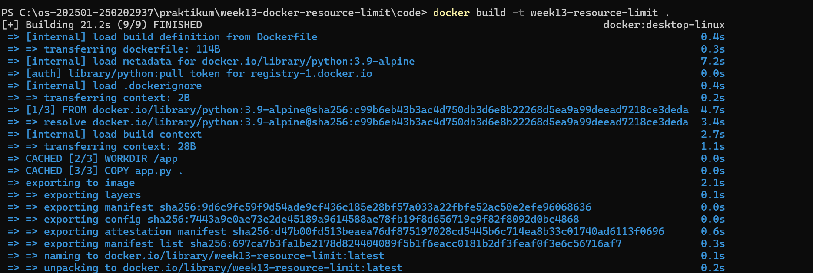

# Laporan Praktikum Minggu 13
Topik: Docker – Resource Limit (CPU & Memori)

---

## Identitas
- **Nama**  : Faizal Muzaki 
- **NIM**   : 250202937 
- **Kelas** : 1IKRB

---

## Tujuan
1. Menulis Dockerfile sederhana untuk sebuah aplikasi/skrip.
2. Membangun image dan menjalankan container.
3. Menjalankan container dengan pembatasan **CPU** dan **memori**.
4. Mengamati dan menjelaskan perbedaan eksekusi container dengan dan tanpa limit resource.
5. Menyusun laporan praktikum secara runtut dan sistematis.
   
---

## Dasar Teori
  - Containerization: Teknologi untuk membungkus aplikasi dan dependensinya ke dalam satu unit terisolasi yang disebut container.
  - Resoursce limits: mekanisme untuk membatasi jumlah CPU dan Memori yang boleh di gunakan oleh container agar tidak mengganggu proses lain di host.
  - control group: fitur kernel linux yang digunakan docker di balik layar untuk mengatur dan memantau pengguna resource proses.
  - Docker stats: Alat monitoring real-time untuk melihat statistik pengguna resource oleh container yang sedang aktif.
- 

---

## Langkah Praktikum

A. Persiapan

1. Mengunduh dan menginstal aplikasi ```Docker Dekstop``` di laptop.
2. Membuka aplikasi agar server bisa berjalan.
3. Instal Extension ```Container Tools``` agar bisa berjalan di ```Visual code```
4. Pastikan Docker terpasang dan berjalan dengan perintah:
```  
docker version
docker ps
```

B. Pembuatan Program uji app.py dan Dockerfile

1. Membuat script Python dengan nama ```app.py``` kemudian simpan code scrip di folder ```code/app.py```
2. Membuat ```Dockerfile``` kemudian simpan di folder ```code/Dockerfile```


C. Build image

1. Melakukan proses build image dari Docker file dengan Perintah ```docker build -t week13-resource-limit .```.
2. Screenshots output terminal dari hasil proses build kemudian di simpan di folder ```screenshots```.

D. Tahap pengujian

1. Menjalankan Container tanpa limitasi resource untuk melihat performa maksimal.
2. Menjalankan Container dengan limitasi ``` --cpus="0.5"``` dan ```--memory="150"```.
   
E. Monitoring

1. Jalankan container dan amati penggunaan resource:
``` docker stats```

F. Commit dan Push

```
git add .
git commit -m "Minggu 13 - Docker Resource Limit"
git push origin main

```


---

## Kode / Perintah
1. Struktur file
   
```
   praktikum/week13-docker-resource-limit/
├─ code/
│  ├─ app.py
│  └─ Dockerfile
├─ screenshots/
│  ├─ docker.build.png
|  ├─ docker.limit resource.png
|  ├─ docker.tanpa limit.png 
|  └─ hasil.limit resource.png
└─ laporan.md

```

2. Isi file Dockerfile
   
```
FROM python:3.9-alpine
WORKDIR /app
COPY app.py .
CMD ["python", "app.py"]

```

3. Isi file app.py

```
import time
import os

def stress_test():
    print("--- Memulai Stress Test Resource ---")
    print(f"PID: {os.getpid()}")
    
    # List untuk menampung data (Stress Memori)
    memory_hog = []
    
    try:
        for i in range(1, 11):
            print(f"\nIterasi ke-{i}")
            
            # Simulasi penggunaan CPU (Perhitungan berat)
            start_time = time.time()
            while time.time() - start_time < 2: # Lakukan loop selama 2 detik
                _ = 1000 * 1000
            
            # Simulasi penggunaan Memori (Menambah 50MB setiap iterasi)
            data = ' ' * (50 * 1024 * 1024) 
            memory_hog.append(data)
            
            print(f"Status: CPU bekerja, Memori bertambah ~{i * 50}MB")
            
    except MemoryError:
        print("\n[ERROR] Out of Memory! Container kehabisan RAM.")
    except Exception as e:
        print(f"\n[ERROR] Terjadi kesalahan: {e}")

if __name__ == "__main__":
    stress_test()

```

4. Command Docker
   
   - Command proses build image
   ```
   docker build -t week13-resource-limit .

   ```

   - Command proses tanpa limit resource
   ```
   docker run --rm week13-resource-limit

   ```

   - Command proses limit resource
      ```
      docker run --rm --cpus="0.5" --memory="150m" week13-resource-limit 
      ```


      
---

## Hasil Eksekusi
 1. Build
   
   

2. tanpa limit
   
   

3. limit resource
   
   

4. hasil limit resource
   
   


---

## Analisis
-  Pengamatan Tanpa Limit: Container mampu menggunakan CPU hingga lebih dari 500% (multicore) dan batas memorinya adalah total RAM yang dialokasikan untuk Docker Desktop (1.77 GB). Program berjalan cepat hingga selesai.
-  Pengamatan Dengan Limit: Saat diberikan limit ```--cpus="0.5"```, penggunaan CPU di ```docker stats``` tertahan di angka maksimal 50%. Hal ini membuat proses eksekusi program terasa lebih lambat (latensi meningkat).
- Efek Limit Memori: Ketika memori dibatasi menjadi ```150m```, program yang terus menambah alokasi data akan dihentikan secara paksa oleh sistem jika melewati batas tersebut (OOM Kill). Ini menunjukkan bahwa Docker berhasil melakukan isolasi resource secara ketat menggunakan cgroups. 

---

## Kesimpulan
1. Docker memungkinkan pengelolaan resource aplikasi secara granular, mencegah satu aplikasi memonopoli seluruh hardware server.
2. Pembatasan CPU berdampak pada kecepatan eksekusi (throtling), sedangkan pembatasan memori yang terlalu ketat dapat menyebabkan aplikasi terhenti (crash/kill).
3.Penggunaan ```docker stats``` sangat penting untuk memvalidasi apakah konfigurasi resource limit sudah diterapkan dengan benar pada container. 

---

## Quiz
1. Mengapa container perlu dibatasi CPU dan memori? 
   **Jawaban:** Untuk mencegah fenomena "Noisy Neighbor", di mana satu container menghabiskan seluruh resource host yang dapat mengakibatkan container lain atau sistem host itu sendiri menjadi tidak stabil atau mati.  
2. Apa perbedaan VM dan container dalam konteks isolasi resource? 
   **Jawaban:**VM mengisolasi resource pada level perangkat keras melalui Hypervisor dengan OS tamu yang lengkap, sehingga alokasi resource cenderung statis. Container mengisolasi resource pada level OS menggunakan kernel Linux (namespaces dan cgroups), sehingga lebih ringan dan fleksibel.   
3. Apa dampak limit memori terhadap aplikasi yang boros memori?
   **Jawaban:** Aplikasi tersebut akan terkena "Out of Memory (OOM) Killer". Kernel akan mengirimkan sinyal untuk menghentikan proses container tersebut agar sistem host tetap berjalan dengan aman.


---

## Refleksi Diri
Tuliskan secara singkat:
- yang paling menantang yaitu memahami kenapa ```docker stats kosong.
- menghapus container yang lama atau sudah tidak digunakan.

---

**Credit:**  
_Template laporan praktikum Sistem Operasi (SO-202501) – Universitas Putra Bangsa_
