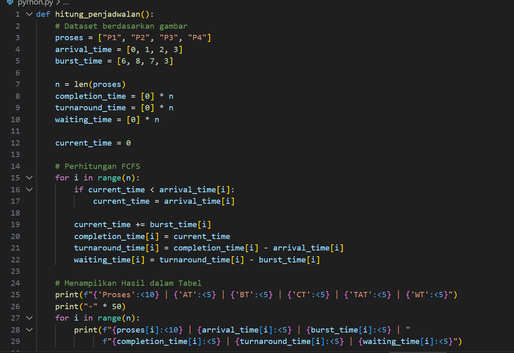
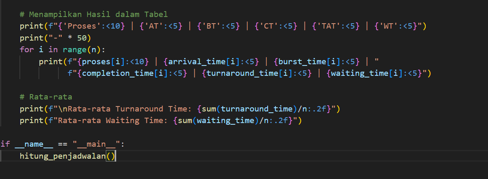
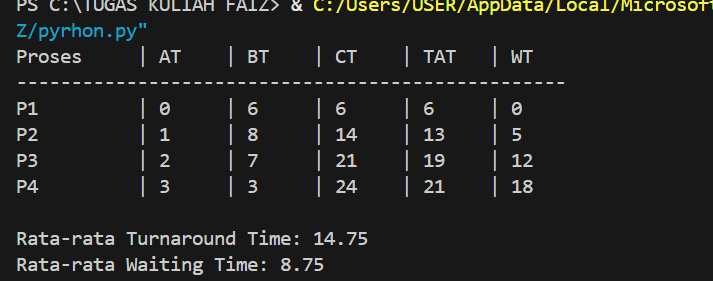

# Laporan Praktikum Minggu 9
Topik: Simulasi Algoritma Penjadwalan CPU 

---

## Identitas
- **Nama**  : Faizal Muzaki 
- **NIM**   : 250202937 
- **Kelas** : 1IKRB

---

## Tujuan
Setelah menyelesaikan tugas ini, mahasiswa mampu:
1. Membuat program simulasi algoritma penjadwalan FCFS dan/atau SJF.  
2. Menjalankan program dengan dataset uji yang diberikan atau dibuat sendiri.  
3. Menyajikan output simulasi dalam bentuk tabel atau grafik.  
4. Menjelaskan hasil simulasi secara tertulis.  
5. Mengunggah kode dan laporan ke Git repository dengan rapi dan tepat waktu.

---

## Dasar Teori
-  Tujuan Utama: Menjamin efisiensi sistem dengan memaksimalkan CPU  Utilization (menjaga CPU tetap sibuk) dan meminimalkan Waiting Time (waktu tunggu proses di antrean).
-  Kriteria Metrik: Keberhasilan algoritma diukur melalui Turnaround Time (total waktu dari proses masuk hingga selesai) dan Throughput (jumlah proses yang diselesaikan per satuan waktu).
-  Burst Time & Quantum: Burst Time adalah durasi yang dibutuhkan proses pada CPU, sedangkan Time Quantum adalah batas waktu maksimal sebuah proses boleh menggunakan CPU sebelum dipindahkan kembali ke antrean (khusus Round Robin).

---

## Langkah Praktikum
1. Siapkan folder kerja praktikum/week9-sim-scheduling/.
2. Membuat file dataset.csvyang berisi daftar proses (P1, P2, P3, P4) lengkap dengan Arrival Time dan Burst Time .
3. Membuat program Python sederhana yang membaca file CSV, mengurutkan data berdasarkan waktu kedatangan, dan menghitung waktu tunggu secara berurutan.
4. Jangkauan program di terminal dan membandingkan hasilnya dengan hitungan manual.
5. Mendokumentasikan seluruh hasil simulasi, perhitungan, dan analisis dalam file laporan.md. 
6. Melakukan commit dan push hasil praktikum ke repositori GitHub.
   
```bash
git add .
git commit -m "Minggu 9 - Simulasi Scheduling CPU"
git push origin main
```


---

## Hasil Eksekusi
Sertakan screenshot hasil percobaan atau diagram:





perintah:
```bash
python code/scheduling_simulation.py

```

---

## Analisis
Berikut adalah keluaran program saat dijalankan dengan dataset uji:




---

## Kesimpulan
Tuliskan 2–3 poin kesimpulan dari praktikum ini.

---

## Quiz
1. [Pertanyaan 1]  
   **Jawaban:**  
2. [Pertanyaan 2]  
   **Jawaban:**  
3. [Pertanyaan 3]  
   **Jawaban:**  

---

## Refleksi Diri
Tuliskan secara singkat:
- Apa bagian yang paling menantang minggu ini?  
- Bagaimana cara Anda mengatasinya?  

---

**Credit:**  
_Template laporan praktikum Sistem Operasi (SO-202501) – Universitas Putra Bangsa_
